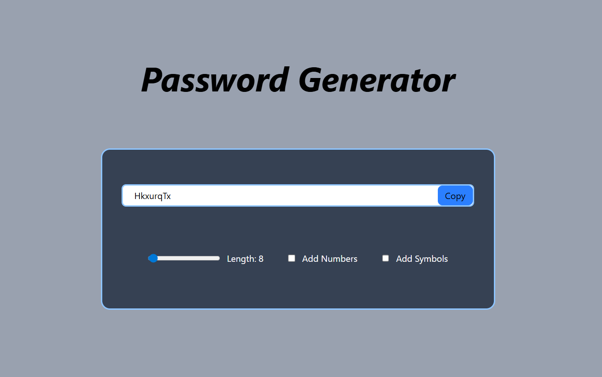

# 📁 Password Generator

A minimal, clean, and interactive **Password Generator** built using **React** and **Tailwind CSS**. This tool allows users to create strong, customizable passwords with options to adjust length, include numbers, and add symbols.

---------------------------------------------------------------------

## ✨ Features

* 🔐 **Generate secure passwords instantly**
* ↕️ **Adjust password length** with slider
* ✔️ **Toggle options** to include numbers and symbols
* 🗋 **Copy to clipboard** functionality
* 💼 **Stylish dark theme UI**
* 👉 Built using **React + Tailwind CSS**

---------------------------------------------------------------------

## 📸 Preview



---------------------------------------------------------------------

## 🧠 How It Works

* **Password Field:** Shows the generated password
* **Length Slider:** Controls how long the password should be
* **Add Numbers:** Includes digits 0-9
* **Add Symbols:** Includes special characters like `!@#$%^&*()_+~|}{[]:;?>`
* **Copy Button:** Copies the generated password to your clipboard with one click

---------------------------------------------------------------------

## 🚀 Tech Stack

* **React** (Vite-based setup)
* **Tailwind CSS** for styling
* **JavaScript** for password generation logic

---------------------------------------------------------------------

## 📁 Project Structure

```
Password-Generator/
├── public/
│   └── logo.svg
│
├── src/
│   ├── App.jsx
│   ├── index.css
│   └── main.jsx
│
├── .gitignore
├── index.html
├── package.json
├── package-lock.json
├── vite.config.js
└── README.md
```

---------------------------------------------------------------------

## 🔧 Installation & Setup

```bash
# Clone the repository
git clone https://github.com/Shreeyog-Gaikwad/Password-Generator.git
cd Password-Generator

# Install dependencies
npm install

# Start the development server
npm run dev
```

Open your browser at `http://localhost:5173` to see it in action.

---------------------------------------------------------------------

## 🤝 Contributing

Pull requests are welcome. For major changes, please open an issue first to discuss what you'd like to change.

---------------------------------------------------------------------

> Made with ❤️ by [Shreeyog Gaikwad](https://github.com/Shreeyog-Gaikwad)

